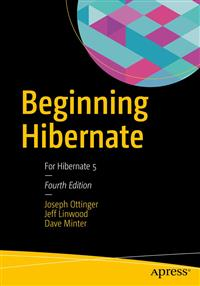

# Apress Source Code

This repository accompanies [*Beginning Hibernate*](http://www.apress.com/9781484223185) by Joseph Ottinger, Jeff Linwood, and Dave Minter (Apress, 2016).

Download the files as a zip using the green button, or clone the repository to your machine using Git.

## Releases

Release v1.0 corresponds to the code in the published book, without corrections or updates.

## Contributions

See the file Contributing.md for more information on how you can contribute to this repository.

## Issues

* Note that the book relies on Hibernate 5.2.X, while Hibernate itself is on the 5.3 branch now.
This is largely due to chapter08 and cache configuration, which Hibernate 5.3 has changed. The source
code will update when cache configuration stabilizes and becomes more transparent.